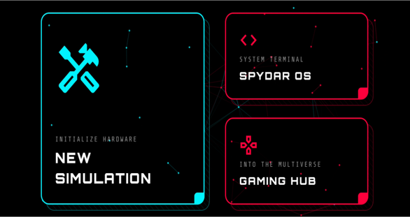
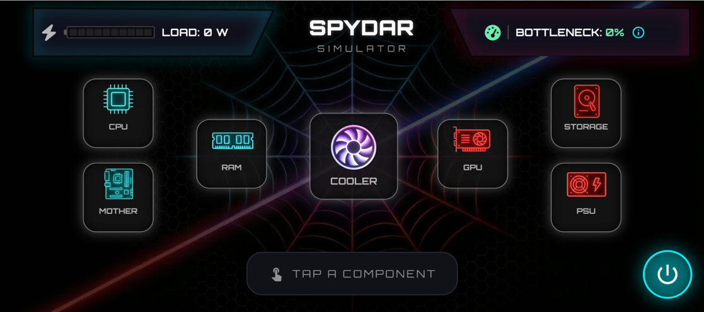
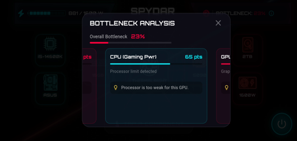
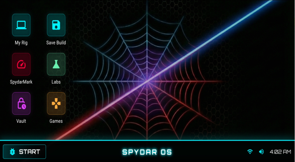
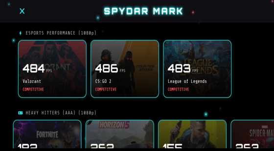
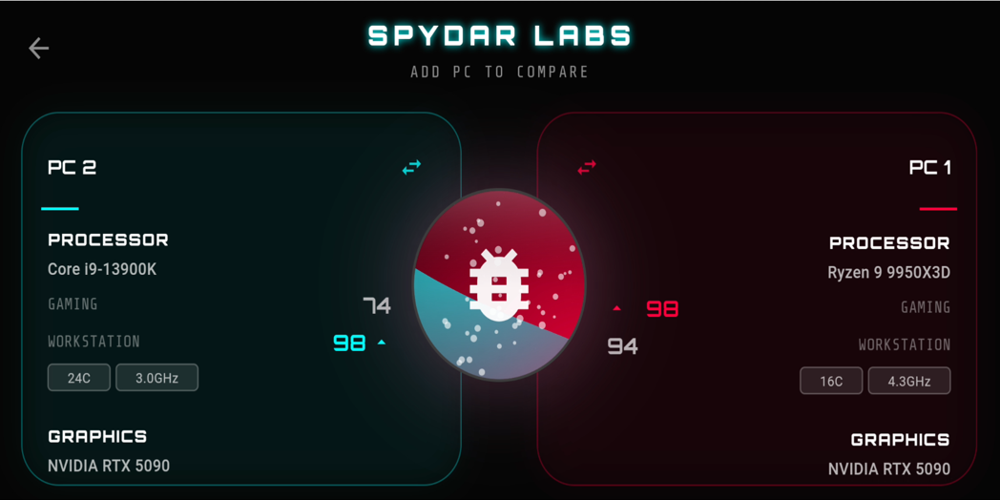

# SPYDAR 🕷️💻
**Smart PC Yield, Diagnostics & Assembly Resolver**


SPYDAR is a high-fidelity, cross-platform mobile application that functions as a professional PC Building Simulator and diagnostic tool. It bridges the complexity gap in modern computer architecture by transforming static hardware specifications into a visual, rule-based engineering sandbox. 

---


## 📸 Screenshots

**| Home Screen | Assembly Dashboard | Bottleneck Analysis |**
| :---: | :---: | :---: | :---: |
|  |  |  |

| OS Screen | SpydarMark | SPYDAR Labs | Campaign Mode |
| :---: | :---: | :---: | :---: |
|  |  |  |  |

---

**📱 Interactive UI & Controls**
SPYDAR is designed with a highly tactile, mobile-first interface, stepping away from traditional web-based list pickers.

**Tap to Select:** The core assembly loop utilizes a streamlined "tap to select" architecture. Users tap an empty component node on the dashboard to instantly open the categorized hardware inventory, allowing for rapid build prototyping.

**Hold to View Details:** Long-pressing any hardware component inside the inventory triggers a deep-dive diagnostic panel. This reveals critical secondary specifications (e.g., PCIe generation, exact VRAM count, or RAM timing speeds) before the user commits to equipping the part.

**Gyroscope Engine (SPYDAR Labs):** The application utilizes the physical device's gyroscopic sensors specifically within the comparative Labs module. Tilting the device triggers a dynamic, water-like fluid effect that visually flows toward the superior PC build, providing intuitive, sensor-based performance feedback.

**✨ Core Features & The Heuristic Engine**
Heuristic Resolver Engine: A deterministic algorithm that actively enforces physical and electrical laws. It instantly detects socket mismatches, invalid RAM generations (DDR4 vs. DDR5), and calculates true aggregate power consumption (including precise motherboard and liquid pump overheads).

**Yield Prediction Module:** Calculates synthetic gaming performance and system bottlenecks. The engine normalizes raw CPU (Geekbench) and GPU (3DMark Time Spy) scores to a 100-point scale.

**SPYDAR OS & The Vault:** A simulated post-build desktop environment featuring live telemetry and persistent JSON-based rig saving.

SPYDAR Labs & Campaign Mode: Features the comparative A/B testing module and a gamified "Spider-verse" campaign. Step into the role of SPYDAR to fulfill complex scenario requests—such as building a custom rig for Doc Ock that satisfies his specific hardware conditions and architectural demands.
---

## 🛠️ Technology Stack

* **Presentation Layer:** Flutter SDK (providing a highly responsive, 60 FPS UI with custom painting and animations).
* **Logic Layer:** Dart (handling asynchronous execution of the Heuristic Resolver and Bottleneck calculations).
* **Data Persistence:** Local JSON Serialization & Shared Preferences (Offline-first architecture).

---

## 🚀 How to Run (Installation & Setup)

To run SPYDAR locally on your Android device or emulator:

1. **Clone the repository:**
   ```bash
   git clone [https://github.com/tharunn077/SPYDAR.git](https://github.com/tharunn077/SPYDAR.git)
